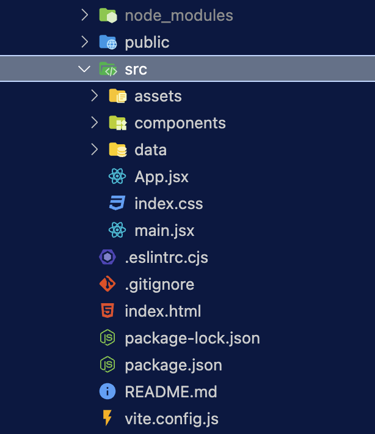

# Application Planning, React Router, React Router data loading, Redux, Redux Toolkit, Thunks, Tailwind CSS

## Screenshots


## Table of contents

- [Application planning](#application-planning)
- [Guidelines](#how-do-you-plan-and-build-a-professional-react-application)
- [Planning Pizza and co](#how-to-apply-these-guidelines-to-our-application)
- [Application Building](#application-planning)

## Application Planning

### _How do you plan and build a professional react application?_

The overarching goal with this application is to **allow users to order pizzas and get them delivered** to their home.

We'll assume the **backend API** is already built, so our job is to build the **frontend**.

From earlier lessons, we learnt that to build a react app we should always :

1. Break the UI into **components**
2. Build a **static** version (no state yet)
3. Think about **state management + data flow**

This works well for small applications. However we need to expand this idea for a large application. Here are the steps we will follow :

1. Gather the application **requirements and features**
2. Based on the information from the first step, **divide the application into pages**:

   - Think about the overall and page-level UI
   - Break the desired UI into components
   - Design and build the static version

3. Divide the application features into **categories**

   - Think about **state management + data flow**

4. Decide which **libraries** to use

### _How to apply these guidelines to our application?_

**Step 1** : gathering the business requirements

**what does the business expect from the application?** :

- A very simple application where users can **order pizzas from a menu**
- This application does not require any authentication, no users accounts and no login : **users just input their names before using the app**
- The pizza menu can change, so it **should be loaded from an API** (this part is already done!)
- Users can add multiple pizzas to a **cart** before ordering
- Ordering requires the user's **name, address and phone number**
- if possible the **GPS location** should be provided to make delivery easier
- Users can **mark their order as priority for an additionnal 20% of the price**
- Orders are made by sending a POST request with the order data(user data + selected pizzas) to the API
- Payments are made on delivery, **no payment processing** is necessary
- Once an order is placed, each **order will get an unique ID** that should be displayed so the **user can look up their order based on the ID**
- Users should be able to mark their order as priority **even after it has been placed**

**Step 2 and 3** : dividing the application into pages and features categories

From the first step we understand that we can divide the **features into four categories** :

1. Features related to the **USER**
2. Features related to the **MENU**
3. Features related to the **CART**
4. Features related to the **ORDER**

From the first step we also understand that we can divide the **application into four pages** :

1. **HOMEPAGE** where users can enter their name to place an order : `/`
2. **PIZZA MENU** where users can see the list of pizzas: `/menu`
3. **CART** where users can add or remove pizza to the cart : `/cart`
4. **PLACE A NEW ORDER** where users can place their order: `/order/new`
5. **LOOKING UP A NEW ORDER** where users can look up an order: `/order/:orderID`

**Step 3 and 4** : state management and technologies choices

Based on our four features categories, we can divide the state into four slices(state domains):

1. **USER**
2. **MENU**
3. **CART**
4. **ORDER**

The way we will manage each slice will depend on the **type of state** :

- User will be **global UI** state because the user information will need to be accesible to all the components in the tree and the data are not fetched from an API.
- Menu will be **global remote state** because the list of pizzas will be fetched from an API
- Cart will be **global UI state** state because the cart information will need to be accesible to all the components in the tree and the data are not fetched from an API.
- Order will be **global remote state** because the order will be posted to an API and also fetched from an API.

As far as technology decisions :

- for routing we will use **React Router**
- for styling we will use **Tailwind CSS**
- for global remote state we will use **React Router**. This allows us to implement a so called **render as you fetch** approach instead of **fetch on render**
- for global UI state we will use **Redux**

## Application Building

### Folders structure

The traditional structure works great for smaller projects.

Below is a sample of what a traditional structure may look like:


Unfortunately, as your project grows the traditional structure falls apart. Over time code becomes harder to find, the project is harder to maintain, and there is a lot of scrolling around the project to change code for a single feature. This is where the concept of **feature folders** come in handy.

This structure gives stronger guidelines to organizing projects into several folders with each folder representing a single feature.

If you’re interested in reading more about best practices to structure and organize a React application, I recommend this [article](https://profy.dev/article/react-folder-structure#prototype-group-by-file-types).

Let's reorganize our folders structure :


- In the **src/** folder we created a folder called **features/**.
- We created a folder for each feature category : **user/**, **menu/**, **cart/** and **order/**
- For reusable components (buttons, inputs etc..) : **ui/**
- For API interactions : **api/**
- For reusable helper functions(number or currerncy manipulation, dates etc...) : **utils/**

To speed up the process, we've already created some components and pre-written the code for the helpers functions and API interactions.
We've also moved them into the appropriate folders.

### Implementing Routes

Let's install react router by running this command :

```sh
npm i react-router-dom
```

In **app.jsx**, we can start by importing `createBrowserRouter()` function from `react-router-dom`

```jsx
import { createBrowserRouter } from 'react-router-dom'
```

As the [documentation](https://reactrouter.com/en/main/routers/create-browser-router) suggests `createBrowserRouter()` takes an array of Route objects with nested routes on the children property.
We can use `createBrowserRouter()` like so:

```jsx
createBrowserRouter([
  {
    path: '/',
    element: <Home />,
  },
  {
    path: '/menu',
    element: <Menu />,
  },
])
```

To use it, we can first save the result of calling `createBrowserRouter()` in a variable called `router` :

```jsx
const router = createBrowserRouter([
  {
    path: '/',
    element: <Home />,
  },
  {
    path: '/menu',
    element: <Menu />,
  },
])
```

and then inside the **App** component, we can use the router like so:

```jsx
function App() {
  return <RouterProvider router={router} />
}
```

if we open up the browser, we should be able to navigate between the pages.

To recap, in the new React Router v6, if we want to use the new powerful apis like `data loaders`, `data actions` or `data fetchers` we need to create a new router using the syntax above (specifying an array of objects where each object represent a route) and we pass that router as a prop to the `<ReactRouterProvider/>` component.

### Building the app layout

The idea is to create a layout that would work on both small and large screens.
The `<Header/>` will always be visible

- Still in the **UI** folder we'll create a file called **Header.jsx** and add this in the file:

```jsx
function Header() {
  return (
    <header>
      <Link to="/">Fast React Pizza Co.</Link>
      <p>Username</p>
    </header>
  )
}

export default Header
```

- In the **UI** folder, we'll create a file called **AppLayout.jsx**, import the `<Header/>` and `<CartOverview/>` components and add this inside :

```jsx
function AppLayout() {
  return (
    <div>
      <Header />
      <main>
        <h1>Content</h1>
      </main>

      <CartOverview />
    </div>
  )
}
```

_How can we connect the `<AppLayout />` with all others components?_

The idea is that we want all other routes to be **nested** inside `<AppLayout/>`.

In the `<App/>` component, we want to add this :

```jsx
const router = createBrowserRouter([
  {
    element: <AppLayout />,
    children: [
      {
        path: '/',
        element: <Home />,
      },
      {
        path: '/menu',
        element: <Menu />,
      },
      {
        path: '/cart',
        element: <Cart />,
      },
      {
        path: '/order/new',
        element: <CreateOrder />,
      },
      {
        path: '/order/:orderId',
        element: <Order />,
      },
    ],
  },
])
```

We created a route for `<AppLayout>` with only one property `children` whose value is an array of all other routes. We nested all other routes inside `<AppLayout/>`
If we open up the browser we should see something like this :


_the `<Outlet/>` component_

To render the nested routes content inside the parent route, we need to use the `<Outlet/>` component from `react-router-dom`. We can modify the `<AppLayout>` component like this :

```jsx
import { Outlet } from 'react-router-dom'

function AppLayout() {
  return (
    <div>
      <Header />
      <main>
        <Outlet />
      </main>

      <CartOverview />
    </div>
  )
}
```

With this in place we should be able to navigate between our routes like so :

.gif>)

### Fetching data with react router loader

The idea is to have a function somewhere in our code that fetches data from an API. We then provide that loader function to one of our routes and that route will get the data on first render.

Let's try and implement this, starting with the menu data. We can achieve this by following these 3 steps :

1. Create a loader function
2. Provide the loader to a route
3. Access the data

- Inside `<Menu/>` component, let's create a loader function:

```jsx
export async function loader() {
  const menu = await getMenu()
  return menu
}
```

The loader is just a wrapper around the `getMenu()` function which is available inside the **api** folder.

- Inside the `<App/>` component, let's provide the loader to the `<Menu/>` route:

```jsx
import Menu, { loader as MenuLoader } from './features/menu/Menu'

const router = createBrowserRouter([
  {
    element: <AppLayout />,
    children: [
      ...
      {
        path: '/menu',
        element: <Menu />,
        loader: menuLoader,
      },
    ...
    ]
  },
])
```

Notice how we've imported the loader using an alias. This is because we want to avoid name collision with other loaders.

Also in the menu route object we added another property called `loader` and passed in `menuLoader` as the value.

- To access the data, we can use a custom hook called `useLoaderData` from `react-router-dom`. Inside `<Menu/>` component we can add this:

```jsx
function Menu() {
  const menu = useLoaderData()
  return <h1>Menu</h1>
}
```

Under the hood, a new `fetch` request is fired off automatically as soon as we access the `<Menu/>` component in the browser. This is the so called `fetch-as-render` strategy. The difference between this approach and the `fetch-on-render` approach using `useEffect()` is that with `useEffect()`, we render the component first and then when the component is fully rendered we then fetch the data from the server (`data loading waterfalls`). With the `fetch-as-render` strategy, the `rendering` and the `fetching` happen at the same time

With this in place, we've successfully connected the loader with the `<Menu/>` component. All we need to do is to create a list with the data received from the server.

```jsx
function Menu() {
  const menu = useLoaderData()

  return (
    <ul>
      {menu.map((pizza) => (
        <MenuItem pizza={pizza} key={pizza.id} />
      ))}
    </ul>
  )
}
```

if we open up the browser we should be able to see the list like so :


### Displaying a loading indicator

The `useNavigation()` hook from `react-router-dom` gives returns an object with a property called `state`.
The `state` property could either be `loading` or `idle` or `submitting`. We will use that information to display the loading indicator.

In the `<App>` component we can add this :

```jsx
function AppLayout() {
  const navigation = useNavigation()
  const isLoading = navigation.state === 'loading'
  return (
    <div className="layout">
      {isLoading && <Loader />}
      <Header />
      <main>
        <Outlet />
      </main>

      <CartOverview />
    </div>
  )
}
```

- We called `useNavigation()` and saved it in the constant navigation
- Created the constant loading and saved the state
- Imported a component called `<Loader/>` that we created in in the **UI** folder
- conditionnally render `<Loader/>` if isLoading is true.

### Handling errors with Error element

In the App component we can add this :

```jsx
const router = createBrowserRouter([
  {
    element: <AppLayout />,
    errorElement: <Error />,
    children: [
      ...
    ],
  },
])
```

- We've imported the `<Error/>` component from **UI** folder.
- Passed the the `<Error/>` component as a value of errorElement property.

if we try and navigate to a page that doesn't exist, we should get a page like this :


We can access the error object and subsequently the error message by using the `useRouteError()` hook like this :

```jsx
function Error() {
  const navigate = useNavigate()
  const error = useRouteError()

  return (
    <div>
      <h1>Something went wrong 😢</h1>
      <p>{error.data || error.message}</p>
      <button onClick={() => navigate(-1)}>&larr; Go back</button>
    </div>
  )
}
```

- we created the constant error to save the error object
- we rendered the error message in the return statement

if we try and create an artificial loading error, we should be able to see a message like this :


Because we want the `<Error/>` component to appear within the layout, we would modify the `<App/>` component like so:

```jsx
const router = createBrowserRouter([
  {
    element: <AppLayout />,

    children: [
     {
        path: '/menu',
        element: <Menu />,
        loader: menuLoader,
        errorElement: <Error />,
    }
      ...
    ],
  },
])
```

### Fetching orders

The idea is to be able to read the order's id and display all the data about it on the order page. The first thing we need to do is to implement a way to search for an order. Essentialy, we want a search field in the header so that we can access the search functionality everywhere in our application.

In the **features/orders** folder, we will create a component called **SearchOrder** and add this inside :

```jsx
function SearchOrder() {
  const [query, setQuery] = useState('')
  const navigate = useNavigate()

  const handleSubmit = (e) => {
    e.preventDefault()
    if (!query) return
    navigate(`order/${query}`)
    setQuery('')
  }
  return (
    <form onSubmit={handleSubmit}>
      <input
        placeholder="Search order #"
        value={query}
        onChange={(e) => {
          setQuery(e.target.value)
        }}
      />
    </form>
  )
}
```

- We've created a state variable `query` to capture the user's input
- Inside the submit handler we used the `useNavigate()` hook to navigate programmatically to the order's page

Now using the `getOrder()` function in the **apiRestaurant** file, we can fetch the order just like we did in for the `<Menu>` component using `fetch-as-render` strategy.

_How can we read the id from the link and pass it to our loader function?_

We cannot use the `useParams()` hook because we can only use it in a component.
Thankfully the react router team thought of this scenario. The loader function can receive an object from which we can extract the params object. Our id parameter is defined like so `path: '/order/:orderId'`, so we can read the id using the `orderId` property :

```jsx
export async function loader({ params }) {
  const order = await getOrder(params.orderId)
  return order
}
```

As we did in the `<Menu/>` component, we can use the `useLoaderData()` hook to access the data :

```jsx
function Order() {
  const order = useLoaderData()
  return ...
}
```

And now we can connect the `loader()` function to the route like so in the `<App/>` component like so :

```jsx
const router = createBrowserRouter([
  {
    element: <AppLayout />,

    children: [
      ...,
      {
        path: '/order/:orderId',
        element: <Order />,
        loader: orderLoader,
      },
    ],
  },
])
```

We've also added the error element in case there's any problem while fetching the order.

If we open up the browser and try to search the order id `CQE92U` we should be able to navigate the order's page and see all the data about that order :


### Writing data with React router `Actions`

[The react router docs](https://reactrouter.com/en/main/route/action) define actions as the "writes" to route loader "reads". In other words, actions allow us to make `POST`, `PUT`, `DELETE` etc.. requests. They provide a way for apps to perform data mutations.

_How to create an order using actions?_

In the `<CreateOrder/>` component, we can add this :

```jsx
//CreateOrder.jsx
function CreateOrder() {
  // const [withPriority, setWithPriority] = useState(false);
  const cart = fakeCart

  return (
    <div>
      <h2>Ready to order? Let's go!</h2>

      <Form method="POST">
        <div>
          <label>First Name</label>
          <input type="text" name="customer" required />
        </div>

        <div>
          <label>Phone number</label>
          <div>
            <input type="tel" name="phone" required />
          </div>
        </div>

        <div>
          <label>Address</label>
          <div>
            <input type="text" name="address" required />
          </div>
        </div>

        <div>
          <input
            type="checkbox"
            name="priority"
            id="priority"
            // value={withPriority}
            // onChange={(e) => setWithPriority(e.target.checked)}
          />
          <label htmlFor="priority">Want to yo give your order priority?</label>
        </div>

        <div>
          <button>Order now</button>
        </div>
      </Form>
    </div>
  )
}

export async function action({ request }) {
  const formData = await request.formData()
  const data = Object.fromEntries(formData)
  console.log(data)
  return null
}

//App.jsx
const router = createBrowserRouter([
  {
    element: <AppLayout />,
    children: [
     ...,
      {
        path: '/order/new',
        element: <CreateOrder />,
        action: createOrderAction,
      },

    ],
  },
])
```

- We imported the `<Form/>` component from `react-router-dom` and wrapped our inputs inside.

- Used the method prop and pass it the value `POST` to make a post request

- Created an action that will intercept the "create order" request as soon as the form is submitted. The action function accept an object from which we can extract the `request` object that contains the form data.

- To connect the action function in the `<CreateOrder/>` component to the route in the `<App/>` component, we've imported the `action()` function and pass it action property of the `createOrder` route. With this in place, whenever there will be a new form submission on this path `order/new` then the action will be executed

if we open the browser and submit the form, we should see the form data printed in the console:


Notice how :

- We did not have to create a submit handler
- We did not have to create a state variable for each of input fiedl
- we did not have to create a loading state

Next up, we also want to get access to the cart data in the `action()` function. For now, we're going to use an hidden `<input/>` field so that the data will be sent during the form submission. Later on we will use `redux` to manage the state cart appropriately.
In the `<CreateOrder/>` component, we can add this :

```jsx
function CreateOrder() {
  // const [withPriority, setWithPriority] = useState(false);
  const cart = fakeCart

  return (
    <div>
      <h2>Ready to order? Let's go!</h2>

      <Form method="POST">
        ...
        <div>
          <input type="hidden" name="cart" value={JSON.stringify(cart)} />
          <button>Order now</button>
        </div>
      </Form>
    </div>
  )
}

...

export async function action({ request }) {
  const formData = await request.formData()
  const data = Object.fromEntries(formData)
  const order = {
    ...data,
    cart: JSON.parse(data.cart),
    priority: data.priority === 'on',
  }
  console.log(order)
  createOrder(order)
  return null
}
```

- We added an input field with type `hidden` and value `cart` transformed into string because the the value prop expects a string as an a value.
- In the action function, we created an order object which will serve as container for the data we getting from the form.
- With this in place, we have the data in a shape that's much easier to manage but more importanty in a data type that's expected by the `createOrder()` function call.
- As soon as the order is created, we also want to redirect the user to the new order's page. This why we used the function `redirect()` from `rect-router-dom` and passed in the path to the order's page.

if we open the browser and create an order, we should be redirected to the order's page with all the information about the order :


To recap :

- Using the react router `<Form>` component, we were able to capture the data submitted by the user
- The data is then intercepted by the action function which performs a post request to create a new order but it is also connected to the path `order/new`.
- As soon as the user clicks on the `order now` button, the action function is executed, the user gets redirected to the new order's page populated with the data submitted using the form.
