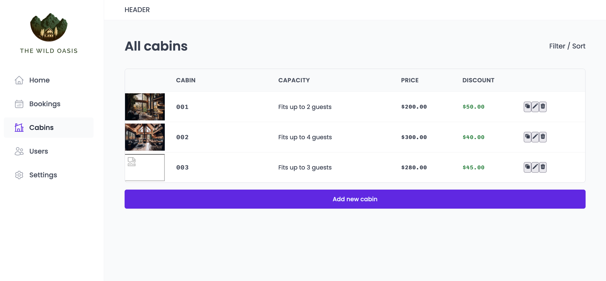

# Wild Oasis - React Query, Styled Components, React Hook Form, Supabase

## Table of contents

- [💻 Application Overview](#application-overview)
  - [📸Screenshot](#screenshot)
  - [🔗Links](#links)
- [Built with](#built-with)
- [📕 What I learned](#what-i-learned)
- [⏭️ Continued development](#continued-development)
- [📚 Useful resources](#useful-resources)

### Application Overview

### Screenshot

### Links

- Live Site URL: [Wild-oasis](https://code-journey-projects-css-flexbox.vercel.app/)

## Built with

**Frontend** :

- React Query
- Styled Components
- React Hook Form

**Backend**:

- Supabase

## What I learned

## Continued development

## Useful resources
